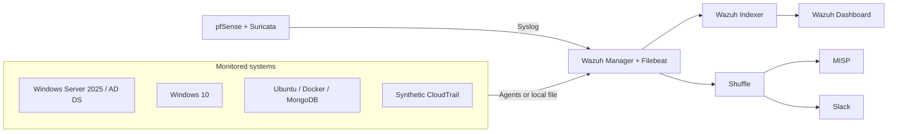

# Open NG-SOC Lab

An evidence-driven NG-SOC laboratory integrating Wazuh, Suricata, MISP, Shuffle, and controlled detection validation.

[](https://github.com/KibnD/open-ng-soc-lab/actions/workflows/ci.yml)

> [!WARNING]
> This is an isolated educational laboratory, **not a production-ready SOC**. Use it only on systems you own or are explicitly authorized to test.

## Architecture



The diagram is deliberately generic. See [architecture documentation](docs/architecture/overview.md) for data flows and trust boundaries.

## Available capabilities

- A documented VMware laboratory with Wazuh 4.8.2 as the tested detection baseline.
- Ten substantive detection or enrichment capabilities with explicit evidence states.
- Private evidence for five successful, controlled Purple Team scenarios.
- Synthetic AWS CloudTrail validation without claiming a real AWS deployment.
- Publication gates that exclude unreviewed rules, credentials, and raw evidence.

## Components

| Layer | Components | Role |
|---|---|---|
| Network | pfSense, Suricata | Segmentation and network telemetry |
| Detection | Wazuh Manager, Indexer, Dashboard, Filebeat | Collection, correlation, search, visualization |
| Endpoints | Three Wazuh agents | Windows and Ubuntu telemetry |
| Identity | Windows Server 2025 AD DS/DNS, Windows 10 | Controlled identity scenarios |
| Workload | Ubuntu, Docker, MongoDB | Container and host telemetry |
| CTI/SOAR | MISP, Shuffle, Slack | IOC enrichment and notification |
| Cloud | Synthetic CloudTrail | Local parser and detection testing only |

## Detection coverage

`tested-private` never means publicly reproduced. See the [evidence policy](docs/evidence/evidence-policy.md).

| Rule | Capability | Level | MITRE ATT&CK | Evidence |
|---:|---|---:|---|---|
| 100051 | Priority 1–2 Suricata alert | 8 | Signature-dependent | `tested-private` |
| 100052 | Windows event-log clearing | 12 | T1070.001 | `tested-private` |
| 100053 | Synthetic CloudTrail `CreateAccessKey` | 12 | T1098.001 | `simulated` |
| 100054 | Addition to Domain Admins | 14 | T1098 | `tested-private` |
| 100055 | Successful RC4 Kerberos service ticket | 12 | T1558.003 | `tested-private` |
| 100056 | Audited privileged Docker launch | 12 | T1611 | `tested-private` |
| 100057 | Five failed network logons from one source | 10 | T1110.001 | `tested-private` |
| 100058 | Suspicious PowerShell Script Block | 10 | T1059.001 | `tested-private` |
| 100059 | Service launching a command shell | 12 | T1543.003 | `tested-private` |
| 100100 | MISP-enriched suspicious SSH source | 12 | Contextual enrichment | `tested-private` |

The authoritative inventory is [`manifest.json`](detections/tests/manifest.json). Exact rules remain unpublished until their laboratory XML, dependencies, and sanitized fixtures pass audit.

## Architecture and data flow

Agents send events to Wazuh; pfSense/Suricata sends lab-only Syslog; synthetic CloudTrail events are read locally. Wazuh indexes alerts for the dashboard. Selected alerts can reach Shuffle, be enriched against MISP, and be summarized to Slack. The lab's Syslog and Wazuh-to-Shuffle links are unencrypted and unsuitable for production.

## Quick start

The repository currently provides deterministic **static publication checks**, not a one-command deployment:

```powershell
pwsh -File scripts/validate_repository.ps1
```

With Python 3.11+:

```text
python scripts/validate_repository.py
python -m unittest discover -s tests -v
```

These checks do **not** execute Wazuh. See [prerequisites](docs/deployment/prerequisites.md).

## Rule validation

Public reproduction requires audited XML, required decoders/dependencies, positive and negative fixtures, expected output, and a successful compatible `wazuh-logtest` run. Static and optional Wazuh integration checks are separated. See [detection testing](detections/README.md).

## Purple Team scenarios

| Scenario | Scope | Result |
|---|---|---|
| PT-01 | Controlled Suricata/pfSense pipeline | PASS — private evidence |
| PT-02 | Synthetic SSH IOC → MISP → Shuffle → Slack | PASS — private evidence |
| PT-03 | Controlled RC4 Kerberos ticket | PASS — private evidence |
| PT-04 | Temporary Domain Admins membership | PASS — private evidence and rollback |
| PT-05 | Windows log clearing | **NOT RUN** — intentionally avoided as destructive |
| PT-06 | No-network/no-mount privileged container | PASS — private evidence and cleanup |

## MISP, Shuffle, and Slack

The integration ran in the private lab. Its export is deferred until security audit and credential rotation are complete. A separate [clean-room MISP client](integrations/misp/README.md) uses environment variables, TLS verification, timeouts, bounded retries, response limits, and synthetic tests. A sanitized [Shuffle manual-build blueprint](integrations/shuffle/README.md) and Slack template are present; a directly importable workflow remains pending disposable-instance testing.

## Known limitations

- VMware capacity and cold-start order affect the lab.
- Wazuh 4.8.2 is the only confirmed baseline.
- AWS is synthetic; no real AWS account, GuardDuty, or `wazuh-aws` connector was tested.
- Rule XML, decoders, fixtures, and integration source require audited lab export.
- Credential rotation incident INC-006 remains a release blocker.
- Licensing and internship ownership are unresolved.

## Repository structure

```text
.github/        Community templates and CI
detections/     Wazuh sources, tests, fixtures, and schemas
docs/           Architecture, deployment, detections, runbooks, case studies
infrastructure/ Reproducible infrastructure guidance
integrations/   Sanitized MISP, Shuffle, and Slack material
scripts/        Local validators
simulations/    Controlled tests and cleanup
third-party/    Provenance records
```

## Documentation

Start with [repository status](REPOSITORY_STATUS.md), [architecture](docs/architecture/overview.md), [coverage](docs/detections/coverage-matrix.md), and the [lab export checklist](docs/LAB_EXPORT_CHECKLIST.md).

## Security and authorized use

Never submit credentials, tokens, personal data, raw indexes, unsafe packet captures, malware, VM disks, or confidential topology. See [SECURITY.md](SECURITY.md).

## Contributing

Contributions must be reproducible, sanitized, and limited to authorized defensive testing. See [CONTRIBUTING.md](CONTRIBUTING.md).

## Roadmap

The provisional sequence is detection pack (`v0.1.0`), MISP (`v0.2.0`), Shuffle/Slack (`v0.3.0`), expanded coverage (`v0.4.0`), then fully documented Purple Team validation (`v1.0.0`). No release or tag exists. See [ROADMAP.md](ROADMAP.md).

## License

**No open-source license is currently granted.** Ownership and compatibility review are pending. See [LICENSE-PENDING.md](LICENSE-PENDING.md).

## Citation

Metadata is in [CITATION.cff](CITATION.cff), but no released version should be cited yet.

French overview: [README.fr.md](README.fr.md).
